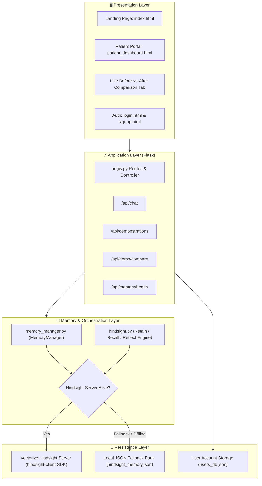

# 🏥 Aegis AI — Memory-Enabled Hospital Management Assistant

[](https://www.python.org/downloads/)
[](https://flask.palletsprojects.com/)
[](https://github.com/vectorize-io/hindsight)
[](LICENSE)

> **Aegis AI** is an AI-powered hospital management platform and patient companion equipped with persistent agent memory powered by [Vectorize Hindsight](https://github.com/vectorize-io/hindsight). It transforms standard stateless healthcare interactions into an intelligent, context-aware continuum of care.

---

## 📑 Table of Contents
- [Overview & Problem Statement](#-overview--problem-statement)
- [Why Agent Memory?](#-why-agent-memory)
- [System Architecture](#-system-architecture)
- [Before vs. After Hindsight Demonstration](#-before-vs-after-hindsight-demonstration)
- [Core Features](#-core-features)
- [Repository Structure](#-repository-structure)
- [Getting Started & Installation](#-getting-started--installation)
- [Configuration & Environment Variables](#-configuration--environment-variables)
- [API Reference](#-api-reference)
- [Official Hindsight Resources](#-official-hindsight-resources)

---

## 🩺 Overview & Problem Statement

In conventional clinical AI chatbots, conversations are ephemeral:
- **No Long-term Recall**: The assistant forgets critical patient history (allergies, chronic conditions, family risk factors) between visits.
- **Repetitive Questioning**: Patients are repeatedly asked about their preferred appointment times, doctor preferences, and dietary restrictions.
- **Fragmented Care & Safety Risks**: The agent cannot correlate a new symptom reported today with surgery details discussed weeks ago.

**Aegis AI resolves this using Vectorize Hindsight memory banks**, allowing the agent to continuously **Retain**, **Recall**, and **Reflect** on patient context across multiple sessions safely and accurately.

---

## 🧠 Why Agent Memory?

[What is Agent Memory?](https://vectorize.io/what-is-agent-memory) Agent memory allows AI systems to retain personalized state, semantic facts, and relational context over time. In Aegis AI:
1. **Selective Retention**: Intelligently identifies useful clinical facts, preferences, and safety notes from natural conversations.
2. **Context-Aware Semantic Recall**: Retrieves relevant past medical facts, preferences, and visit history before formulating a response.
3. **Safety Fallback Engine**: Seamless dual-engine architecture that connects to the live Hindsight server (`hindsight-client`) with zero-downtime graceful fallback to encrypted local persistent storage.

---

## 🏗️ System Architecture



---

## ⚖️ Before vs. After Hindsight Demonstration

Aegis AI provides a dedicated, interactive side-by-side comparison suite highlighting the difference agent memory makes:

| Scenario | Patient Prompt | ❌ Without Hindsight (Stateless AI) | ✅ With Aegis Hindsight Memory |
| :--- | :--- | :--- | :--- |
| **1. Allergy & Safety Recall** | *"What antibiotic should I take for this dental infection?"* | *"Amoxicillin 500mg is standard. Consult your doctor."* <br>⚠️ **Dangerous: Forgets penicillin allergy!** | *"⚠️ Caution: Your medical profile notes a severe Penicillin allergy. Amoxicillin is contraindicated. Recommending Clindamycin/Erythromycin alternatives."* |
| **2. Patient Scheduling Preferences** | *"Book my next appointment."* | *"When are you available? Please provide preferred date and time."* | *"I recalled you prefer morning slots before 10:00 AM. I have reserved 9:00 AM this Thursday with Dr. Smith (Cardiology)."* |
| **3. Post-Operative Follow-Up** | *"I'm having some chest tightness today."* | *"Chest pain can have various causes like muscle strain or anxiety. Rest and monitor."* | *"🚨 Priority Alert: Correlating this with your cardiac stent procedure from 2 weeks ago. Alerting Dr. Smith and hospital triage immediately."* |
| **4. Diet & Lifestyle Context** | *"Can I eat grapefruit with my new medication?"* | *"Grapefruit is healthy and rich in vitamin C. Enjoy in moderation."* | *"⛔ Important: Recalling your Statin prescription (Atorvastatin) from last visit. Grapefruit inhibits CYP3A4 metabolism and increases toxicity risk."* |

---

## ✨ Core Features

- 🏥 **Live Patient Portal**: Real-time queue tracker, appointment management, health metrics, and clinical records.
- 🔮 **Interactive Memory Inspector**: In-dashboard visualizer for stored patient preferences, clinical observations, and Hindsight facts.
- ⚡ **Side-by-Side Live Comparison Sandbox**: Test custom queries against both Stateless and Memory-Augmented agents with response time metrics.
- 🛡️ **Persistent User State**: Automated account management supporting real-time signup and login with persistent records.
- 🔌 **CLI & Script Demonstrations**: Run automated technical demos directly in the terminal via `python demo.py`.

---

## 📁 Repository Structure

```
AEGIS-AI/
├── aegis.py                  # Core Flask web server, API routes, and session handlers
├── memory_manager.py         # Official Vectorize Hindsight client integration & fallback
├── hindsight.py              # Clinical memory reasoning engine (Retain, Recall, Reflect)
├── demo.py                   # Standalone CLI demonstration script
├── requirements.txt          # Python dependencies
├── .env.example              # Environment variables template
├── .gitignore                # Git exclusions
├── users_db.json             # Persistent patient account database
├── hindsight_memory.json     # Persistent patient memory & facts bank
├── index.html                # Modern landing page & feature overview
├── patient_dashboard.html    # Patient dashboard with chat & comparison tab
├── login.html                # User authentication interface
├── signup.html               # New patient onboarding interface
├── patientreg.html           # In-hospital patient registration
├── records.html              # Health records & diagnostic history
└── otpverify.html            # Multi-factor authentication verification
```

---

## 🚀 Getting Started & Installation

### Prerequisites
- Python **3.10** or higher
- (Optional) Docker for running local Vectorize Hindsight server

### 1. Clone the Repository
```bash
git clone https://github.com/brahmanik07/Aegis-AI.git
cd Aegis-AI
```

### 2. Install Dependencies
```bash
pip install -r requirements.txt
```

### 3. Setup Environment Variables
```bash
cp .env.example .env
```
Edit `.env` to configure your Hindsight server endpoint (or leave defaults for local fallback mode):
```env
HINDSIGHT_BASE_URL=http://localhost:8888
HINDSIGHT_API_KEY=
HINDSIGHT_BANK_ID=aegis_hospital
HINDSIGHT_TIMEOUT=300.0
```

### 4. (Optional) Run Vectorize Hindsight Server via Docker
```bash
docker run -p 8888:8888 vectorize/hindsight:latest
```
*(If the server is not running, Aegis AI automatically switches to local persistent memory fallback with zero configuration needed).*

### 5. Launch Aegis AI
```bash
python aegis.py
```
Visit **[http://127.0.0.1:5000](http://127.0.0.1:5000)** in your browser.

---

## 💻 CLI Demonstration Mode

To run a fast terminal-based comparison of memory capabilities:
```bash
python demo.py
```
Or run through the main application:
```bash
python aegis.py --demo
```

---

## 📡 API Reference

| Endpoint | Method | Description |
| :--- | :--- | :--- |
| `/api/chat` | `POST` | Interacts with Aegis AI assistant with memory retention & recall |
| `/api/demonstrations` | `GET` | Retrieves all standard Before vs. After clinical scenarios |
| `/api/demo/compare` | `POST` | Compares query responses with and without Hindsight memory |
| `/api/memory/health` | `GET` | Returns Hindsight server connectivity status and bank statistics |
| `/api/appointments` | `GET/POST` | Manages patient appointment schedules |
| `/signup` | `POST` | Registers a new patient profile and initializes memory bank |
| `/login` | `POST` | Authenticates user and recalls patient context |

---

## 📚 Official Hindsight Resources

- 🐙 **Hindsight GitHub Repository**: [github.com/vectorize-io/hindsight](https://github.com/vectorize-io/hindsight)
- 📖 **Official Hindsight Documentation**: [hindsight.vectorize.io](https://hindsight.vectorize.io/)
- 🧠 **Vectorize Agent Memory Guide**: [vectorize.io/what-is-agent-memory](https://vectorize.io/what-is-agent-memory)

---

## 👥 Contributors & Acknowledgements
- Developed for **Aegis AI Healthcare Systems**.
- Special thanks to the **Vectorize.io** team for the Hindsight agent memory framework.
